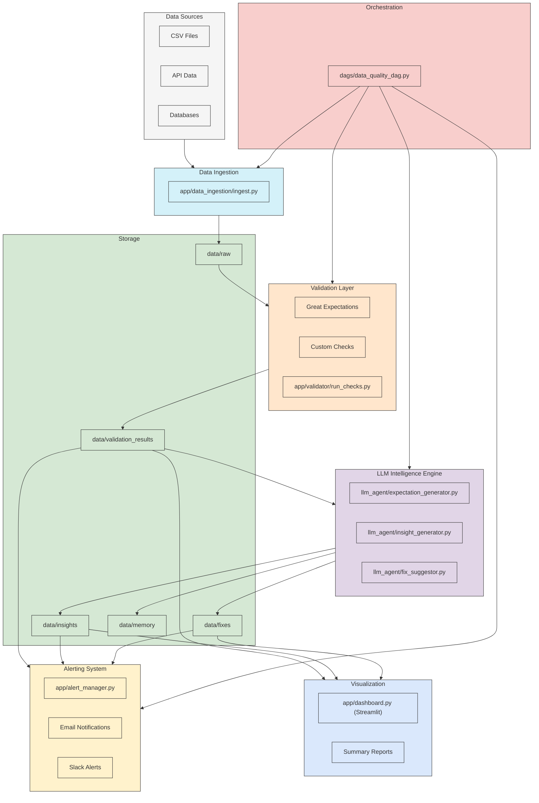

# AI-Powered Data Quality Monitor

An intelligent data quality system that continuously monitors datasets for anomalies, schema drift, missing values, and suspicious patterns. It uses LLMs to provide explanations, auto-generated test cases, and remediation suggestions.

## 🏗️ System Architecture



## 🛠️ Core Stack

| Layer | Tools |
|-------|-------|
| Ingestion | Airflow / Pandas / Spark |
| Validation | Great Expectations + custom rules |
| LLM Insight | LangChain + DeepSeek / OpenAI / Ollama |
| Storage | S3 / Parquet / Delta |
| Visualization | Streamlit / Superset |
| Alerting | Email, Slack, or webhook |
| CI/CD | Docker + GitHub Actions |

## 🔍 Key Features

### ✅ Data Validation Rules
* Missing values, null rate
* Schema drift / column type change
* Value range checks, duplicates

### ✅ LLM-Powered Insights
* "Why is this failing?"
* "What does this anomaly mean?"
* "Suggest a better threshold or check"

### ✅ Auto-Test Suggestion
* LLM generates Great Expectations YAML config based on data

### ✅ Alerting System
* Slack/email alerts on validation failures
* Summary logs + human-readable diagnosis

### ✅ Dashboard
* Streamlit UI to explore:
   * Daily DQ report
   * Failing checks
   * Fix suggestions
   * Anomaly charts

## 🚀 Advanced Ideas

| Feature | Description |
|---------|-------------|
| 🧠 Memory | Store historical DQ trends to detect drift over time |
| 🔁 Active Learning | Flagged rows get reviewed by users, improving LLM fix recommendations |
| 📥 REST API | Expose validation pipeline as an API for plug-and-play use |

## 🗂️ Project Folder Structure

```
ai-data-quality-monitor/
│
├── dags/                  # Airflow DAGs (optional)
├── data/                  # Sample data files
├── expectations/          # Great Expectations config and suites
├── llm_agent/             # LLM logic: LangChain chains, fix suggestor
├── app/                   # Streamlit app code
├── tests/                 # Unit tests for checks
├── docker/                # Dockerfiles, entrypoints
├── requirements.txt
├── README.md
└── .github/workflows/     # CI/CD pipelines
```

## 📦 Installation

```bash
# Clone the repository
git clone https://github.com/yourusername/ai-data-quality-monitor.git
cd ai-data-quality-monitor

# Create and activate virtual environment
python -m venv venv
source venv/bin/activate  # On Windows: venv\Scripts\activate

# Install dependencies
pip install -r requirements.txt

# Set up Great Expectations
great_expectations init

# Run the Streamlit app
cd app
streamlit run dashboard.py
```

## 🚀 Usage

1. Place your datasets in the `data/` directory
2. Configure validation rules in the `expectations/` directory
3. Run the data quality checks:
   ```
   python run_validator.py --dataset your_data.csv
   ```
4. View results in the Streamlit dashboard:
   ```
   cd app
   streamlit run dashboard.py
   ```

## 🔧 Configuration

- LLM settings can be configured in `config.yaml`
- Alert thresholds and rules can be modified in `expectations/rules.yaml`